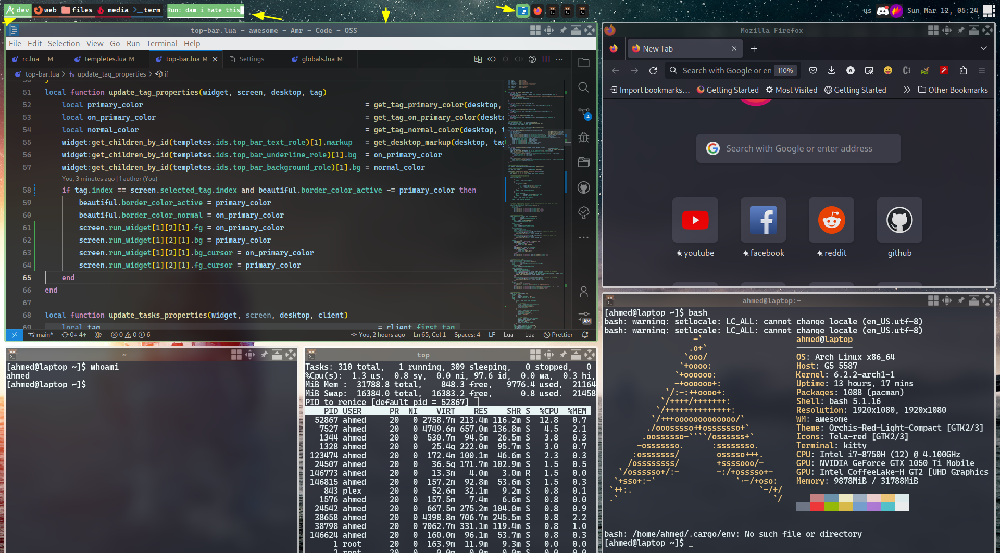

# My Awesome WM configs

this is my awesome wm configured a way suitble for my work flow.

here and there it will be updated with new widgets or adding new features for existing ones.

## Showcase

here are some images.

### whole desktop

### tint desktop feeling

### setting limiting and treshholds for critical values

